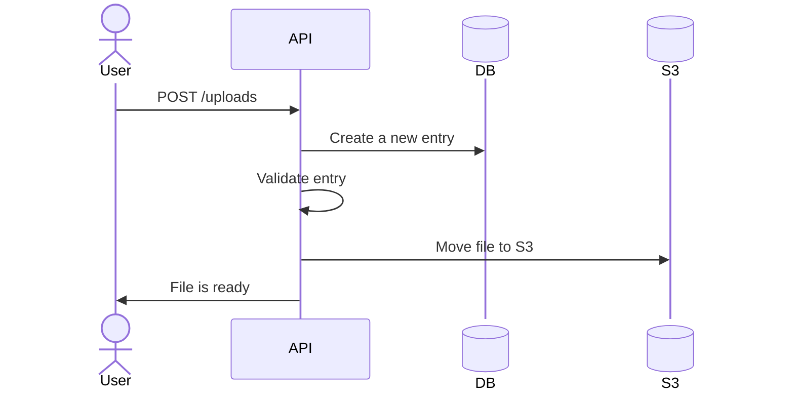
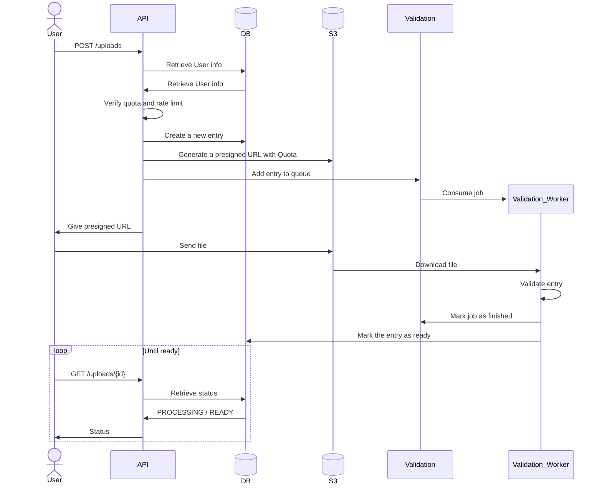

# Arch

Design choices :

- Simple : quick to develop and easier to maintain
- Complete : more complex, but better scalability

## Simple

Validation made by the API (write heavy as API handles routing and read/write of files).
Slower but simpler to make

## Complete

Validation made by a worker, faster as multiple workers can be invoked.
Better scalability

## References

Using Mermaid for generating diagrams.

Used this site for export (removed watermark manually) : <https://www.mermaideditor.io/export/svg>
