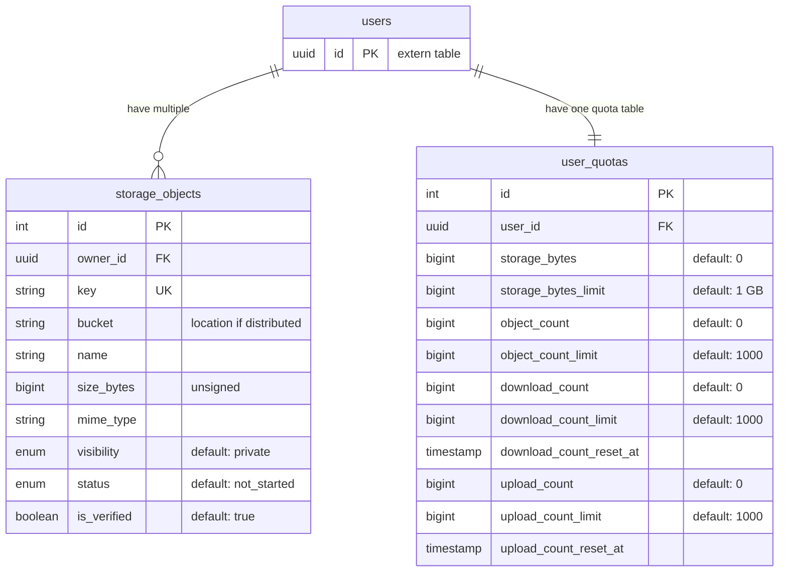

# Database

Schema representing the database.

```mermaid
erDiagram
    users ||--o{ storage_objects : "have multiple"
    users ||--|| user_quotas : "have one quota table"

    users {
        uuid id PK "extern table"
    }

    storage_objects {
        int id PK
        uuid owner_id FK
        string key UK
        string bucket "location if distributed"
        string name
        bigint size_bytes "unsigned"
        string mime_type
        enum visibility "default: private"
        enum status "default: not_started"
        boolean is_verified "default: true"
    }

    user_quotas {
        int id PK
        uuid user_id FK
        bigint storage_bytes "default: 0"
        bigint storage_bytes_limit "default: 1 GB"
        bigint object_count "default: 0"
        bigint object_count_limit "default: 1000"
        bigint download_count "default: 0"
        bigint download_count_limit "default: 1000"
        timestamp download_count_reset_at
        bigint upload_count "default: 0"
        bigint upload_count_limit "default: 1000"
        timestamp upload_count_reset_at
    }
```
