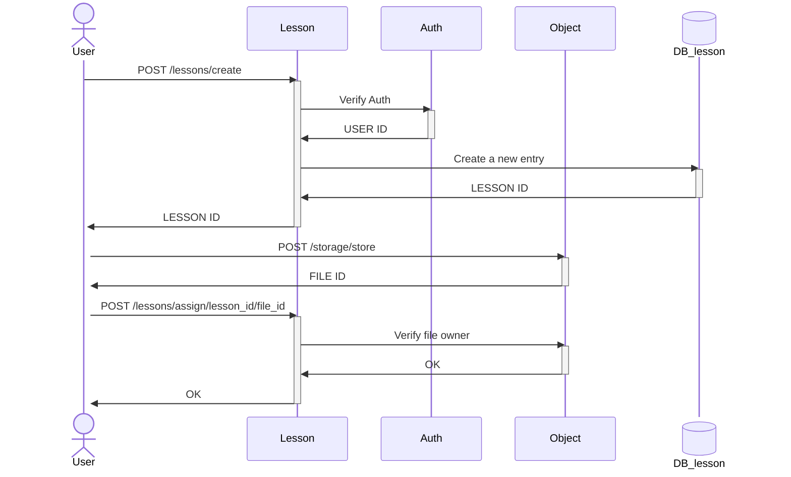

# Lesson

## Create a new lesson with one file upload

The User is already authentificated and gives a token in all the requests.

```mermaid
sequenceDiagram
    actor User
    participant API_lesson as Lesson
    participant API_auth as Auth
    participant API_object as Object
    participant DB_lesson@{ "type" : "database" }

    User->>API_lesson: POST /lessons/create
    activate User
    activate API_lesson
    API_lesson->>API_auth: Verify Auth
    activate API_auth
    API_auth->>API_lesson: USER ID
    deactivate API_auth
    API_lesson->>DB_lesson: Create a new entry
    activate DB_lesson
    DB_lesson->>API_lesson: LESSON ID
    deactivate DB_lesson
    API_lesson->>User: LESSON ID
    deactivate API_lesson
    activate User

    User->>API_object: POST /storage/store
    activate API_object
    API_object->>User: FILE ID
    deactivate API_object

    User->>API_lesson: POST /lessons/assign/lesson_id/file_id
    activate API_lesson
    API_lesson->>API_object: Verify file owner
    activate API_object
    API_object->>API_lesson: OK
    deactivate API_object
    API_lesson->>User: OK
    deactivate API_lesson
```
