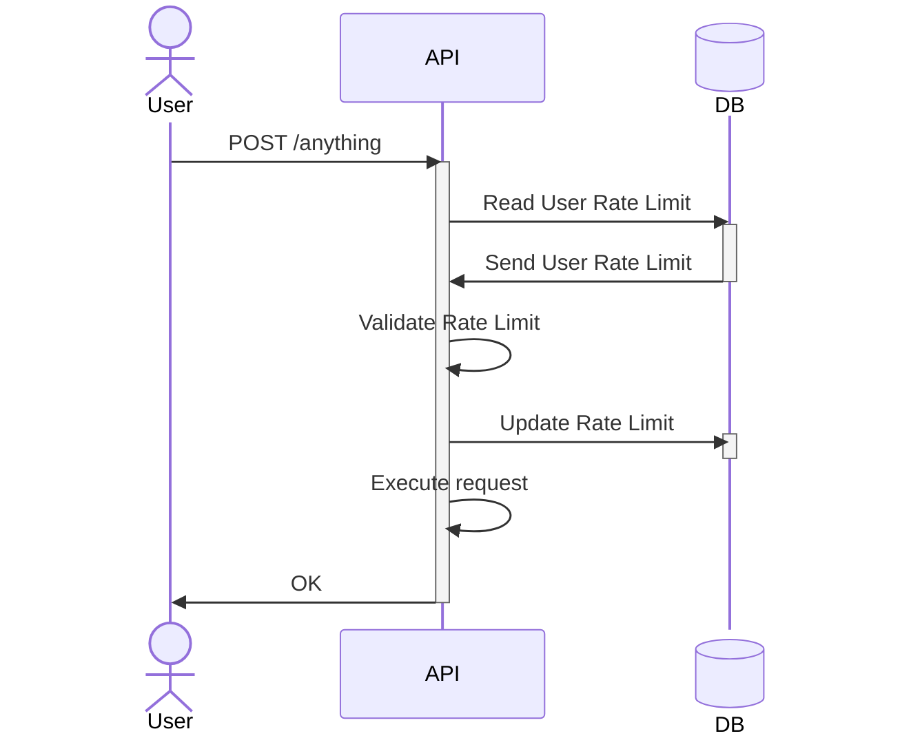
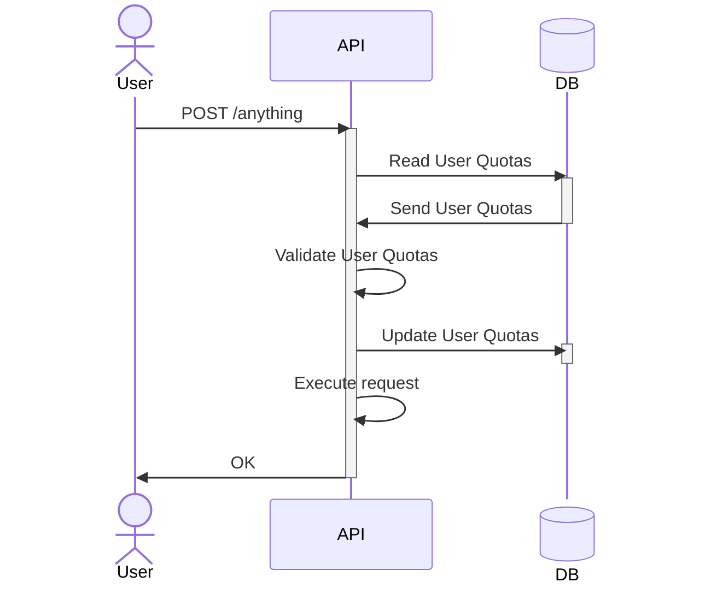

# Quotas

## Quota



---



```rules
si current_date > upload_count_reset_at | download_count_reset_at
	update to current

si upload_count >= upload_count_limit | download_count >= download_count_limit
	reject

si object_count >= object_count_limit
	reject

si new file + storage_bytes >= storage_bytes_limit
	reject

OK
```

## Rate limiting

## References

Using Mermaid for generating diagrams.

Used this site for export (removed watermark manually) : <https://www.mermaideditor.io/export/svg>
