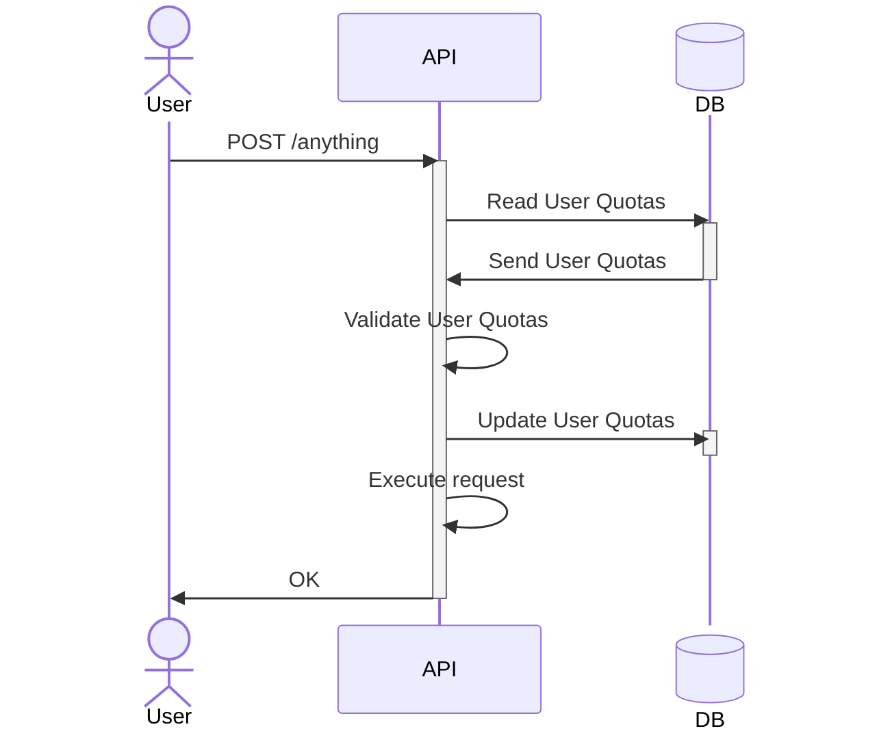

# Quotas

Quotas contains Users's statistics of their usage of this API. 
It handles:
- the number of different files (a huge number of small files can be heavier on disk than some big files).
- A maximum allowed storage space by user, and rate limit of actions on theses objects, download and upload.

## Quota

## References

Using Mermaid for generating diagrams.

Used this site for export (removed watermark manually) : <https://www.mermaideditor.io/export/svg>
